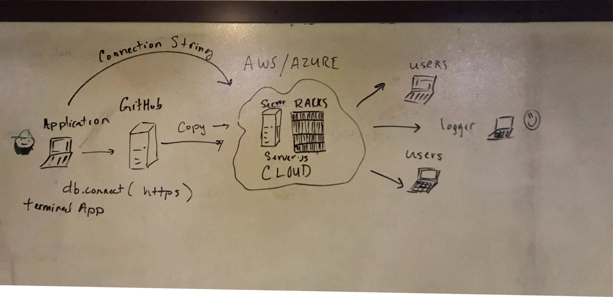

# LAB - 19

### Authors: Jonny

# Deploying App On AWS

### Links and Resources
* [submission PR](https://github.com/401-advanced-javascript-jonnygraybill/socket-test) 

### Modules
#### app.js
#### console.js
#### theword.js
#### server.js

#### Running the app
* `node app.js` should start app.js
* `node console.js` should send the console.log over to the app.js terminal

### UML

